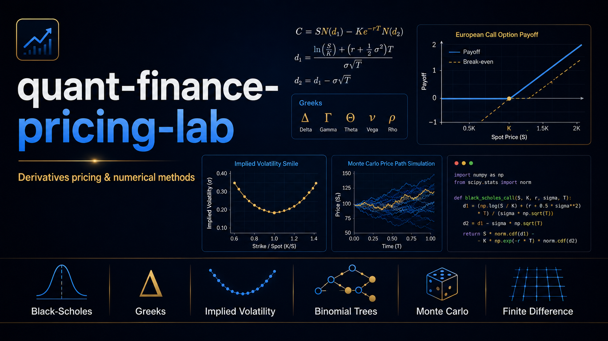
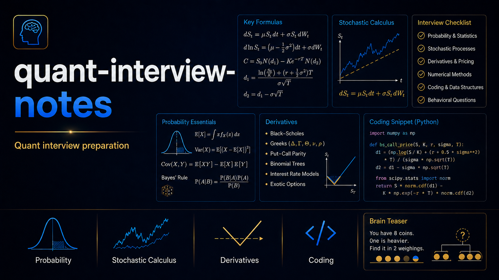

  

<h1 align="center">Xiaodong Yang</h1>

  <strong>CQF</strong> · <strong>FRM</strong> · <strong>CMA</strong>

  PhD Candidate in Quantitative Finance · Option-Implied Information · Risk-Neutral Density · Tail Risk · Financial Forecasting

  
  &nbsp;&nbsp;&nbsp;
  
  &nbsp;&nbsp;&nbsp;
  

---

## About Me

I am a PhD candidate in Quantitative Finance at University College Dublin.  
My research focuses on option-implied information, risk-neutral and physical distributions, tail risk, density forecasting, and financial risk measurement.

My GitHub is used as a technical portfolio for quantitative finance, derivatives pricing, numerical methods, financial risk management, and research-oriented programming.

---

## Featured Projects

<table width="100%">
<tr>
<td width="33%" align="center" valign="top">

</td>
<td width="33%" align="center" valign="top">

</td>
<td width="33%" align="center" valign="top">

</td>
</tr>
</table>

---

## Research Interests

- Option-implied information and risk-neutral density recovery
- Tail risk, Value-at-Risk, and Expected Shortfall
- Density forecasting and predictive evaluation
- Derivatives pricing and numerical methods
- Machine learning applications in financial markets

---

## Technical Skills

**Programming:** Python, R, MATLAB, SQL  

**Quantitative Finance:** option pricing, implied volatility, risk-neutral density, tail risk, VaR, Expected Shortfall  

**Data Science:** NumPy, pandas, SciPy, scikit-learn, time-series modelling  

**Numerical Methods:** Monte Carlo simulation, binomial trees, finite difference methods, finite element methods  

**Research Tools:** LaTeX, Git, GitHub, Jupyter Notebook, VS Code  

---

## Selected Research Keywords

`Option-Implied Information` · `Risk-Neutral Density` · `Physical Density` · `Tail Risk` · `GEV` · `GPD` · `State Price Density` · `Density Forecasting` · `VaR` · `Expected Shortfall` · `Pricing Kernel` · `S&P 500 Options` · `ETF Options`

---

## Current Focus

I am currently working on recovering option-implied distributions from index and ETF options, studying downside tail risk, and evaluating the forecasting performance of risk-neutral and physical densities.

At the same time, I am building public GitHub projects to demonstrate my technical skills in derivatives pricing, numerical methods, quantitative finance, and financial risk management.

---

  
  &nbsp;&nbsp;
  
  &nbsp;&nbsp;
  
  &nbsp;&nbsp;
  
  &nbsp;&nbsp;

